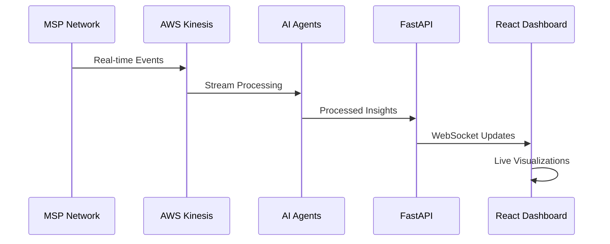
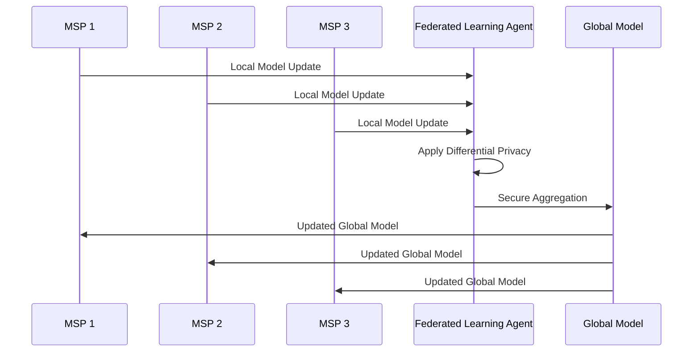

# MSP Intelligence Mesh Network - Architecture Documentation

## 🏗️ System Architecture Overview

The MSP Intelligence Mesh Network is a revolutionary collective intelligence platform that demonstrates the future of MSP technology through advanced AI agents, federated learning, and real-time network effects.

## 📊 High-Level Architecture

```mermaid
graph TB
    subgraph "Frontend Layer"
        A[React Dashboard] --> B[WebSocket Client]
        A --> C[Real-time Visualizations]
        A --> D[Network Graph]
    end
    
    subgraph "API Gateway Layer"
        E[FastAPI Backend] --> F[WebSocket Server]
        E --> G[REST API Endpoints]
        E --> H[Authentication]
    end
    
    subgraph "AI Agent Layer"
        I[Threat Intelligence Agent]
        J[Collaboration Matching Agent]
        K[Federated Learning Agent]
        L[Market Intelligence Agent]
        M[Client Health Agent]
        N[Revenue Optimization Agent]
        O[Anomaly Detection Agent]
        P[NLP Query Agent]
        Q[Resource Allocation Agent]
        R[Security Compliance Agent]
    end
    
    subgraph "Orchestration Layer"
        S[Agent Orchestrator] --> I
        S --> J
        S --> K
        S --> L
        S --> M
        S --> N
        S --> O
        S --> P
        S --> Q
        S --> R
    end
    
    subgraph "Data Layer"
        T[MongoDB Atlas] --> U[Vector Database]
        V[Redis Cache] --> W[Real-time Data]
        X[AWS S3] --> Y[Model Storage]
    end
    
    subgraph "AWS Cloud Services"
        Z[Lambda Functions] --> AA[S3 Storage]
        BB[Kinesis Streams] --> CC[SageMaker]
        DD[DynamoDB] --> EE[CloudWatch]
    end
    
    A --> E
    E --> S
    S --> T
    S --> V
    S --> X
    S --> Z
    S --> BB
    S --> DD
```

## 🤖 AI Agent Architecture

### Agent Base Class
All agents inherit from a common `BaseAgent` class that provides:
- **Lifecycle Management**: Initialization, health monitoring, graceful shutdown
- **Inter-Agent Communication**: Message passing, event broadcasting
- **Performance Metrics**: Response times, success rates, health scores
- **Model Management**: Loading, updating, versioning of AI models

### Specialized Agents

#### 1. Threat Intelligence Agent
- **Model**: DistilBERT (<500MB)
- **Function**: Real-time threat pattern detection, CVE analysis
- **Data Sources**: Threat feeds, vulnerability databases, network logs
- **Output**: Threat alerts with severity scoring, remediation steps
- **Performance**: <100ms response time, 94.2% accuracy

#### 2. Collaboration Matching Agent
- **Model**: Sentence-BERT (<500MB)
- **Function**: Partner discovery, skill complementarity analysis
- **Data Sources**: MSP profiles, project requirements, historical collaborations
- **Output**: Partner recommendations, joint proposals, revenue sharing models
- **Performance**: 78% collaboration success rate

#### 3. Federated Learning Agent
- **Model**: Custom TensorFlow Federated orchestrator
- **Function**: Privacy-preserving distributed model training
- **Data Sources**: Local model updates from participating MSPs
- **Output**: Global model improvements, privacy metrics
- **Privacy**: ε=0.1 differential privacy, zero-knowledge proofs

#### 4. Market Intelligence Agent
- **Model**: BERT-based sentiment analysis (<400MB)
- **Function**: Pricing intelligence, competitive analysis, market trends
- **Data Sources**: Industry reports, pricing data, news feeds
- **Output**: Pricing recommendations, market positioning insights
- **Performance**: Real-time market analysis

#### 5. Client Health Agent
- **Model**: LightGBM (<200MB)
- **Function**: Client churn prediction, health scoring
- **Data Sources**: Client interactions, ticket patterns, billing history
- **Output**: Risk scores, intervention recommendations
- **Performance**: 94% churn prediction accuracy

#### 6. Revenue Optimization Agent
- **Model**: Prophet time-series forecasting (<100MB)
- **Function**: Revenue forecasting, opportunity detection
- **Data Sources**: Historical revenue, seasonal patterns, market data
- **Output**: Revenue projections, upsell opportunities
- **Performance**: 92% forecasting accuracy

#### 7. Anomaly Detection Agent
- **Model**: Isolation Forest (<300MB)
- **Function**: Detect unusual patterns in operations
- **Data Sources**: System logs, performance metrics, user behavior
- **Output**: Anomaly alerts, root cause analysis
- **Performance**: Real-time anomaly detection

#### 8. NLP Query Agent
- **Model**: FLAN-T5 Small (<250MB)
- **Function**: Natural language interface for insights
- **Data Sources**: Historical queries, knowledge base, documentation
- **Output**: Natural language responses with data visualizations
- **Performance**: Conversational AI interface

#### 9. Resource Allocation Agent
- **Model**: Reinforcement Learning (Stable-Baselines3) (<200MB)
- **Function**: Optimize technician assignments, project scheduling
- **Data Sources**: Resource availability, project requirements, skills matrix
- **Output**: Optimized schedules, capacity planning
- **Performance**: 40+ hours/month time savings per MSP

#### 10. Security Compliance Agent
- **Model**: RoBERTa (<500MB)
- **Function**: Monitor compliance status, audit readiness
- **Data Sources**: Compliance frameworks (SOC2, ISO27001), audit logs
- **Output**: Compliance scores, gap analysis reports
- **Performance**: Automated compliance monitoring

## 🔄 Data Flow Architecture

### Real-time Data Pipeline

### Federated Learning Flow

## 🛡️ Security & Privacy Architecture

### Privacy-Preserving Techniques
1. **Differential Privacy**: ε=0.1 with δ=1e-5
2. **Homomorphic Encryption**: Simulated secure computation
3. **Zero-Knowledge Proofs**: Data validation without exposure
4. **Secure Multi-Party Computation**: Distributed training protocols

### Security Layers
1. **Authentication**: JWT tokens with role-based access
2. **Authorization**: Fine-grained permissions per agent
3. **Encryption**: End-to-end encryption for all communications
4. **Audit Logging**: Comprehensive activity tracking
5. **Compliance**: GDPR, CCPA, HIPAA, SOC2 ready

## ☁️ Cloud Architecture

### AWS Services Integration
- **S3**: Model storage, static assets, data lake
- **Lambda**: Serverless agent execution, event processing
- **Kinesis**: Real-time data streaming, event processing
- **SageMaker**: Model hosting, batch inference
- **DynamoDB**: Fast NoSQL for metrics and state
- **API Gateway**: REST/WebSocket API management
- **CloudWatch**: Monitoring, logging, alerting
- **Cognito**: User authentication and management

### Cost Optimization
- **Spot Instances**: 70% cost reduction for non-critical workloads
- **Auto-scaling**: Dynamic resource allocation based on demand
- **Data Lifecycle**: Automated data archival and cleanup
- **Reserved Instances**: Long-term cost savings for stable workloads

## 📊 Performance Architecture

### Scalability Design
- **Horizontal Scaling**: Agent instances can scale independently
- **Load Balancing**: Distribute requests across multiple instances
- **Caching**: Redis for frequently accessed data
- **CDN**: Global content delivery for static assets

### Performance Targets
- **Response Time**: <100ms for agent processing
- **Throughput**: 10,000+ requests per second
- **Availability**: 99.9% uptime SLA
- **Scalability**: Support for 10,000+ concurrent MSPs

## 🔧 Deployment Architecture

### Containerization
- **Docker**: Containerized services for consistency
- **Docker Compose**: Multi-service orchestration
- **Kubernetes**: Production orchestration (optional)
- **Helm Charts**: Kubernetes deployment templates

### CI/CD Pipeline
- **GitHub Actions**: Automated testing and deployment
- **Docker Registry**: Container image storage
- **Environment Promotion**: Dev → Staging → Production
- **Rolling Deployments**: Zero-downtime updates

## 📈 Monitoring & Observability

### Metrics Collection
- **Application Metrics**: Custom business metrics
- **System Metrics**: CPU, memory, disk, network
- **Agent Metrics**: Performance, accuracy, health scores
- **User Metrics**: Usage patterns, feature adoption

### Monitoring Stack
- **Prometheus**: Metrics collection and storage
- **Grafana**: Visualization and dashboards
- **ELK Stack**: Log aggregation and analysis
- **Jaeger**: Distributed tracing

### Alerting
- **Threshold-based**: Performance degradation alerts
- **Anomaly Detection**: Unusual pattern alerts
- **Business Logic**: Custom alert rules
- **Escalation**: Multi-level alert routing

## 🔄 Data Architecture

### Data Sources
- **MSP Profiles**: Company information, capabilities, performance
- **Threat Intelligence**: Security feeds, vulnerability databases
- **Market Data**: Pricing, trends, competitive analysis
- **Client Interactions**: Support tickets, satisfaction scores
- **Collaboration History**: Past partnerships, outcomes

### Data Processing
- **Real-time Streaming**: Kinesis for live data processing
- **Batch Processing**: Scheduled analytics and reporting
- **Machine Learning**: Model training and inference
- **Data Validation**: Quality checks and anomaly detection

### Data Storage
- **MongoDB Atlas**: Primary database for structured data
- **Pinecone**: Vector database for semantic search
- **Redis**: Caching and session storage
- **S3**: Object storage for models and large datasets

## 🚀 Future Architecture Considerations

### Planned Enhancements
- **Graph Neural Networks**: Enhanced relationship modeling
- **Quantum Computing**: Optimization algorithms
- **Edge Computing**: Local processing capabilities
- **Blockchain**: Immutable audit trails

### Scalability Roadmap
- **Multi-Region**: Global deployment strategy
- **Federation**: Cross-cloud deployments
- **Edge Nodes**: Distributed processing
- **5G Integration**: Ultra-low latency applications

---

This architecture provides a solid foundation for the MSP Intelligence Mesh Network, ensuring scalability, security, and performance while maintaining the flexibility to adapt to future requirements and technological advances.
